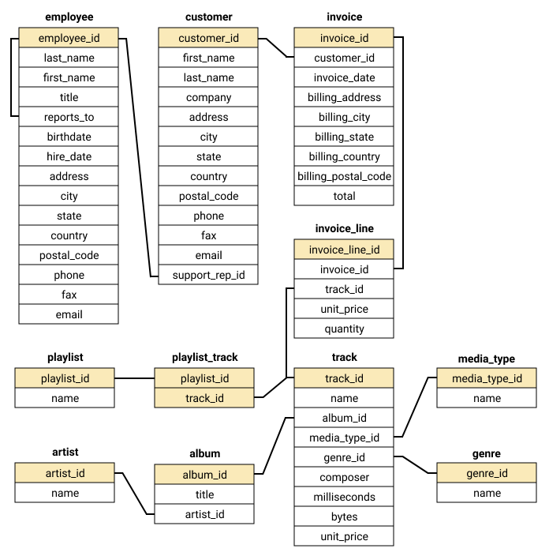

# SQL playground

This repository is for trifling with a sample MySQL database, to test out advanced queries. See the [repository Jupyter Notebook](https://github.com/dwitvliet/SQL-playground/blob/main/SQL-playground.ipynb). More sample queries will be added soon with more detailed descriptions.

## Database diagram

## Setup if you want to run the notebook yourself

1) Install MySQL 8.0.

2) Install dependencies:
   
        python3 -m pip install requirements.txt
    
3) Setup database: 

        setup.sh | sudo -u root mysql